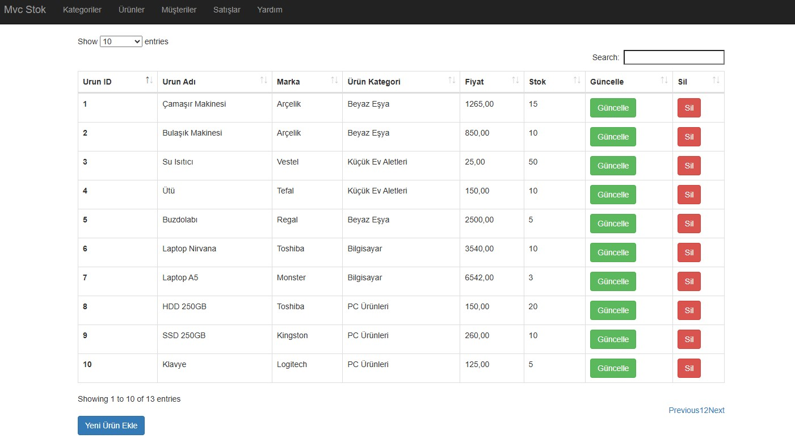
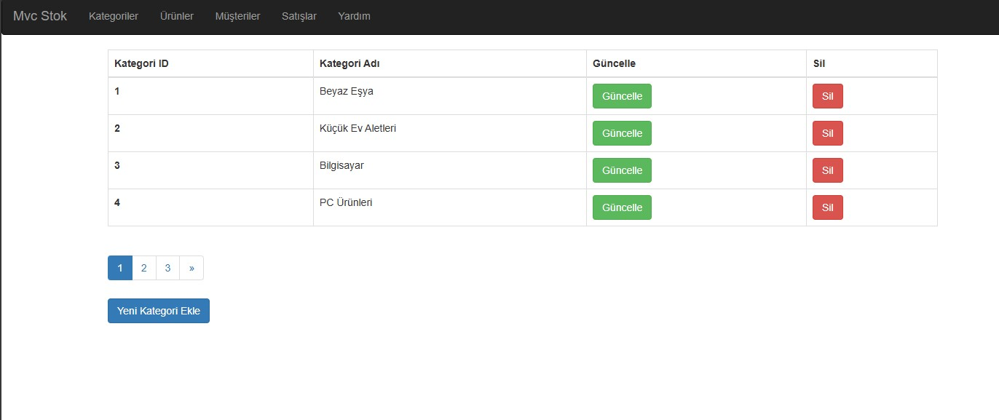
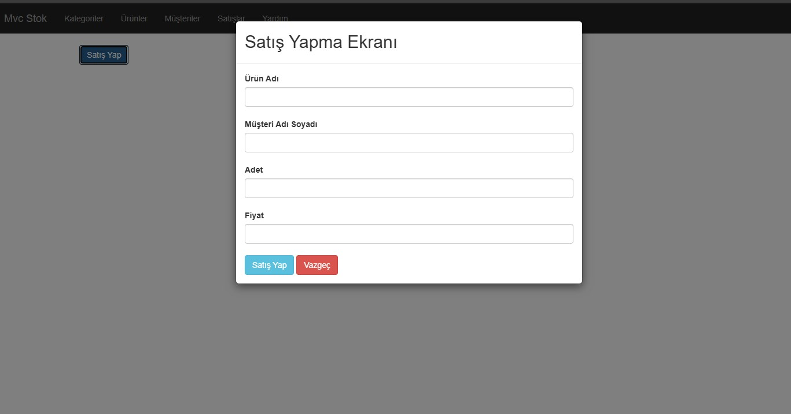

# MvcStok Projesi

M&Y Yazılım Eğitim Akademi Danışmanlık bünyesinde, Murat Yücedağ hocamın 'Full Stack .Net Core Development' eğitimi kapsamında, YouTube üzerinde bulunan 50 Derste Asp.Net ile MVC Stok serisini tamamladım.

Bu proje, **ASP.NET MVC** framework'ü kullanılarak bir web uygulaması geliştirme sürecini adım adım açıklayan bir serinin parçasıdır. "MvcStok" projesi, temel envanter yönetim sistemi geliştirmenin yanı sıra, CRUD işlemleri, kullanıcı kimlik doğrulaması ve veri doğrulama konularını kapsamaktadır.

## Proje Özellikleri

- **Envanter Yönetimi**: Kullanıcılar, stok ürünleri ekleyebilir, güncelleyebilir, silebilir ve listeleyebilir.
- **CRUD İşlemleri**: Stok yönetimi için Tamamen Create, Read, Update, Delete işlemleri uygulanmıştır.
- **Veri Doğrulama**: Envantere yalnızca geçerli verilerin eklenmesini ve güncellenmesini sağlar.

## Kullanılan Teknolojiler

- **ASP.NET MVC 5**: Web uygulamaları geliştirmek için kullanılan framework.
- **Entity Framework**: Veritabanı işlemleri için kullanıldı.
- **SQL Server**: Stok verilerini depolamak için kullanılan veritabanı.
- **Bootstrap**: Ön yüz tasarımı ve duyarlılık için.
- **C#**: Projenin ana programlama dili.

## Kurulum Adımları

1. Depoyu klonlayın:
   ```bash
   git clone https://github.com/DifferenTismail/50-Derste-Mvc.git
   ```

2. **Visual Studio** ile projeyi açın.

3. NuGet paketlerini geri yüklemek için, çözüm üzerine sağ tıklayıp "NuGet Paketlerini Geri Yükle" seçeneğini seçin.

4. `web.config` dosyasındaki bağlantı dizesini kendi yerel SQL Server sunucunuza göre güncelleyin.

5. Visual Studio ile projeyi derleyip çalıştırın.

## Ekran Görüntüleri




## Katkıda Bulunma

Bu projeyi forklayarak geliştirmelere katkıda bulunabilir veya iyileştirme önerileri için pull request açabilirsiniz.

